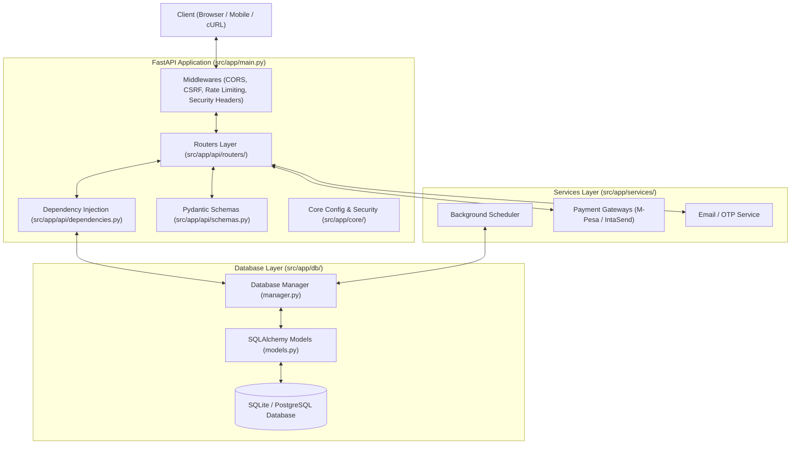

# Bursar 2.0 : Automated Daily Budget Allowance Platform

[](https://bursar.co.ke)
[](https://www.python.org/)
[](https://fastapi.tiangolo.com/)
[](https://aws.amazon.com/)
[](LICENSE)

> **Live Production App → [bursar.co.ke](https://bursar.co.ke)**

**Bursar 2.0** is an automated personal financial management platform engineered to eliminate impulse spending for mobile money (M-Pesa) users. Instead of holding an entire month's income on M-Pesa where it is vulnerable to impulsive purchases, users deposit and lock their budget in Bursar. An autonomous background scheduler daemon then disburses back exact, pre-planned daily allowances directly to their M-Pesa phone number at their chosen time every single day.

---

## Table of Contents
1. [Project Overview & Motivation](#project-overview--motivation)
2. [Key Features](#key-features)
3. [System Architecture](#system-architecture)
4. [Technology Stack](#technology-stack)
5. [Repository Structure](#repository-structure)
6. [Payment Gateways & Modes](#payment-gateways--modes)
7. [Getting Started & Local Setup](#getting-started--local-setup)
8. [API Quick Demo & Code Snippets](#api-quick-demo--code-snippets)
9. [Running Automated Tests](#running-automated-tests)
10. [CI/CD & Deployment Pipeline](#cicd--deployment-pipeline)
11. [Contributing](#contributing)
12. [Acknowledgements & Resources](#acknowledgements--resources)

---

## Project Overview & Motivation

### The Problem
Most people receive their monthly salary, freelance earnings, or allowance as a lump sum. When the full amount sits in an instantly accessible mobile wallet like Safaricom M-Pesa, frictionless digital payments make it remarkably easy to exhaust funds during the first two weeks of the month.

### The Bursar Solution
Bursar acts as an **automated digital allowance dispenser**:
1. **Lock the Monthly Budget:** Users deposit funds via M-Pesa STK Push and lock their budget allocations. Once locked, funds cannot be manually withdrawn until the schedule concludes.
2. **Automated Daily Disbursement:** A background daemon evaluates user payout schedules and initiates real M-Pesa B2C disbursements to their registered phone number.
3. **Pacing & Accountability:** Users receive only what they planned for each day (e.g., Food, Transport, Airtime), stretching their income across the entire month.

### Target Audience
- **Salaried Employees** seeking disciplined monthly cashflow management.
- **University Students** managing fixed allowances and recurring expenses.
- **Freelancers & Gig Workers** smoothing out irregular bulk payouts.
- **Mobile Money Users** aiming to overcome impulse digital transactions.


---

## System Architecture

The following diagram illustrates the complete end-to-end request flow, automated scheduler processing, payment webhooks, and cloud database persistence:




---

## Technology Stack

| Layer | Technologies |
|---|---|
| **Cloud & Hosting** | **AWS EC2** (Ubuntu Linux, Systemd daemon), **AWS RDS** (Managed MySQL/PostgreSQL), **Nginx** |
| **Backend Framework** | **Python 3.10+**, **FastAPI**, **Uvicorn** (ASGI server), **Pydantic v2** |
| **Database & ORM** | **SQLAlchemy ORM**, **SQLite** (Local Dev/Testing with WAL mode), **AWS RDS** (Production) |
| **Security & Cryptography** | **PBKDF2-HMAC-SHA256**, **AES-GCM / HKDF**, **SlowAPI** (Rate Limiter), **Google reCAPTCHA v3**, **CSRF Tokens** |
| **Payment Integrations** | **Safaricom Daraja API** (STK Push, B2C), **IntaSend Payments** (STK Push, B2C, Webhooks) |
| **AI & Search Engine** | **Google Gemini API** (`gemini-2.5-flash`), **Rank-BM25** (Local RAG Indexer) |
| **Frontend** | **HTML5**, **Modern CSS3 Glassmorphism**, **Vanilla JavaScript (ES6+)**, **Chart.js** |
| **Testing & CI/CD** | **Pytest** (Unit & Integration), **Playwright** (E2E Browser Tests), **GitHub Actions** |

---

## Repository Structure

```
Bursar-2.0/
├── .github/
│   └── workflows/
│       └── deploy.yml              # Multi-stage CI/CD pipeline (Test, Audit, Deploy to EC2)
├── src/
│   └── app/                        # Core application package
│       ├── main.py                 # FastAPI app entry point, middleware & lifespan
│       ├── api/
│       │   ├── dependencies.py     # Dependency injection (DB, Session manager)
│       │   ├── schemas.py          # Pydantic request/response validation schemas
│       │   └── routers/
│       │       ├── auth.py         # Registration, login, logout, password reset, 2FA
│       │       ├── budget.py       # Budget category CRUD & lock status
│       │       ├── callbacks.py    # Daraja & IntaSend payment webhook handlers
│       │       ├── deposits.py     # STK push initiation & polling status
│       │       ├── notifications.py# In-app notification center endpoints
│       │       ├── payouts.py      # Manual payout triggers & transaction logs
│       │       ├── profile.py      # Profile management, 2FA, avatar upload
│       │       └── settings.py     # User settings, payment mode, schedules
│       ├── core/
│       │   ├── config.py           # App configuration & environment validation
│       │   ├── csrf.py             # CSRF token validation middleware
│       │   ├── encryption.py       # HKDF key derivation & AES credential encryption
│       │   ├── limiter.py          # SlowAPI rate limiting configuration
│       │   ├── password.py         # PBKDF2 password hashing & verification
│       │   ├── security.py         # Session token generation & constant-time auth
│       │   └── security_headers.py # HTTP security headers (CSP, HSTS, X-Frame)
│       ├── db/
│       │   ├── manager.py          # Database operations, transactions & state guards
│       │   └── models.py           # SQLAlchemy declarative ORM models
│       ├── services/
│       │   ├── email.py            # SMTP / transactional email notification service
│       │   ├── intasend.py         # IntaSend STK Push & B2C payout client
│       │   ├── mpesa.py            # Safaricom Daraja STK Push & B2C client
│       │   ├── payment_gateway.py  # Unified payment provider abstraction layer
│       │   ├── recaptcha.py        # Google reCAPTCHA v3 score verification
│       │   └── scheduler.py        # Background payout daemon & retry worker
│       └── static/                 # Frontend assets (HTML5, Glassmorphism CSS, JS)
│           ├── dashboard.html      # Authenticated user dashboard
│           ├── index.html          # Public landing & login/registration portal
│           ├── css/style.css       # Design system & responsive styles
│           └── js/app.js           # Client-side API interactions & chart renderers
├── tests/                          # Automated test suite (50+ unit/integration tests)
│   ├── test_auth.py                # Authentication, sessions & hashing tests
│   ├── test_concurrency_race_conditions.py # Webhook vs. polling race condition tests
│   ├── test_idempotency.py         # Idempotency key verification tests
│   ├── test_rate_limiting.py       # SlowAPI rate limiting tests
│   ├── test_scheduler.py           # Daily payout schedule & lock evaluation tests
│   └── e2e/                        # Playwright browser integration tests
├── CONTRIBUTING.md                 # Open-source contribution guidelines
├── requirements.txt                # Python backend dependencies
├── package.json                    # Node dependencies for Playwright testing
└── README.md                       # Main project documentation
```

---

## Payment Gateways & Modes

Bursar 2.0 provides seamless switching between sandbox simulation and production financial rails:

| Gateway | Deposits (STK Push) | Payouts (B2C) | Supported Modes |
|---|---|---|---|
| **IntaSend** | ✅ Supported | ✅ Supported | `simulation`, `sandbox`, `live` |
| **Safaricom Daraja** | ✅ Supported | ✅ Supported | `simulation`, `sandbox`, `live` |

---

## Getting Started & Local Setup

### 1. Prerequisites
- **Python 3.10+** (Python 3.11 recommended)
- **Node.js 18+** & **npm** (optional, for browser test suite)
- **Git**

### 2. Clone Repository
```bash
git clone https://github.com/kiptuidenis/Bursar-2.0.git
cd Bursar-2.0
```

### 3. Create & Activate Virtual Environment
```bash
# Windows
python -m venv venv
.\venv\Scripts\activate

# macOS / Linux
python3 -m venv venv
source venv/bin/activate
```

### 4. Install Dependencies
```bash
pip install --upgrade pip
pip install -r requirements.txt
```

### 5. Configure Environment Variables
Copy `.env.example` to `.env`:
```bash
cp .env.example .env
```

Key environment configuration:
```env
# Application Secret (minimum 32 characters)
SECRET_KEY=generate_a_secure_random_32_char_secret_key

# Payment Gateway (simulation / sandbox / live)
PAYMENT_PROVIDER=intasend
INTASEND_MODE=simulation
INTASEND_SECRET_KEY=your_intasend_secret_key
INTASEND_PUBLISHABLE_KEY=your_intasend_publishable_key

# Database Connection (Leave empty for local SQLite bursar.db)
DATABASE_URL=

# Rate Limiting & Security
RATE_LIMITING_ENABLED=true
SESSION_COOKIE_SECURE=false # Set to true in HTTPS production
```

### 6. Run the Application Locally
```bash
python -m uvicorn src.app.main:app --reload --port 8000
```
Open your browser and navigate to **`http://127.0.0.1:8000`**.

---

## API Quick Demo & Code Snippets

### 1. User Registration & Login
#### cURL Request:
```bash
curl -X POST "http://127.0.0.1:8000/api/auth/login" \
  -H "Content-Type: application/json" \
  -d '{
    "email": "alex@example.com",
    "password": "StrongPassword2026!"
  }'
```
#### Expected Response (`200 OK`):
```json
{
  "status": "success",
  "message": "Login successful",
  "user": {
    "id": 1,
    "email": "alex@example.com",
    "phone_number": "254712345678"
  }
}
```

---

### 2. Initiate M-Pesa STK Push Deposit
#### Python Snippet (`requests`):
```python
import requests

session = requests.Session()

# 1. Initiate STK Push deposit of KES 5,000
deposit_payload = {
    "amount": 5000,
    "phone_number": "254712345678"
}
response = session.post("http://127.0.0.1:8000/api/deposit/stk-push", json=deposit_payload)
print(response.json())
```
#### Expected Response (`200 OK`):
```json
{
  "status": "success",
  "message": "STK Push initiated successfully",
  "checkout_request_id": "ws_CO_210820261122334455"
}
```

---

### 3. Manual / Scheduled Daily Payout Trigger
#### cURL Request:
```bash
curl -X POST "http://127.0.0.1:8000/api/payout/trigger" \
  -H "Cookie: session_token=your_authenticated_session_token"
```
#### Expected Response (`200 OK`):
```json
{
  "triggered": true,
  "reason": null
}
```

---

## Running Automated Tests

The repository includes extensive automated test coverage across authentication, database constraints, concurrency race conditions, and payment gateway workflows.

### Pytest Unit & Integration Tests
```bash
python -m pytest
```

### Static Syntax & Safety Audit
```bash
python tests/check_js_syntax.py
```

### Playwright End-to-End Tests
```bash
npm install
npx playwright install --with-deps
npm run test:e2e
```

---

## CI/CD & Deployment Pipeline

Every push to the `main` branch triggers an automated GitHub Actions pipeline ([`.github/workflows/deploy.yml`](.github/workflows/deploy.yml)):
1. **Automated Testing:** Sets up Python 3.11 and executes the full Pytest test suite.
2. **Static Syntax Auditing:** Validates JavaScript front-end integrity and syntax.
3. **E2E Browser Verification:** Installs Playwright and validates full user flows.
4. **Zero-Downtime EC2 Deployment:** Securely connects to **AWS EC2 via SSH**, pulls updated code, updates dependencies, and restarts `bursar.service`.

---

## Contributing

Contributions make the open-source community thrive! Please see our [**CONTRIBUTING.md**](CONTRIBUTING.md) for full guidelines on setting up your local environment, coding conventions, and submitting pull requests.

---

## Acknowledgements & Resources

- [Safaricom Daraja API Documentation](https://developer.safaricom.co.ke/)
- [IntaSend Payments Developer Docs](https://intasend.com/docs/)
- [FastAPI Framework](https://fastapi.tiangolo.com/)
- [SQLAlchemy ORM Documentation](https://www.sqlalchemy.org/)

---

## License

This project is licensed under the [MIT License](LICENSE).
